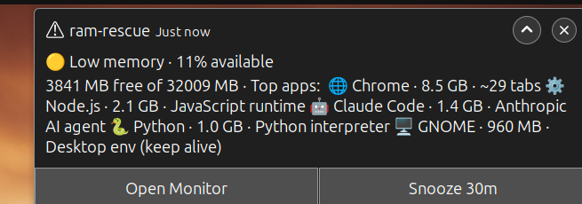

# ram-rescue

**A low-RAM alerter for Linux desktops, built for the era when you run Claude Code, Cursor, and 50 browser tabs at once.**



🌐 **Website:** <https://tgambit65.github.io/ram-rescue/>

Linux GNOME doesn't warn before RAM exhaustion freezes your machine. macOS and Windows do warn — but only at *critical* levels, far too late for an agentic workflow. ram-rescue fires a *configurable* early warning when available memory drops below your threshold (default: 15%), lists the top 5 memory consumers, and gives you one-click access to the system monitor so you can pick what to kill.

**Zero daemon, zero idle cost.** A systemd-user timer wakes a bash script every 60 seconds, it reads memory, decides whether to alert, and exits. No background process, no Electron, no GUI framework — those would defeat the point of a tool that manages your RAM.

### What the alert looks like

```
🟡 Low memory · 12% available
3,900 MB free of 32,009 MB · Top apps:

🌐 Chrome · 6.6 GB · ~45 tabs
🐍 Python · 1.5 GB · Python interpreter
🤖 Claude Code · 1.1 GB · Anthropic AI agent
🖥️ GNOME · 1006 MB · Desktop env (keep alive)
📡 uvicorn · 908 MB · Python ASGI web server
                                       [Open Monitor] [Snooze 30m]
```

Processes are **grouped by app** so you see one row per program (not 50 rows of chrome subprocesses). Each app gets a one-line summary so you know what it is before you kill it. Severity emoji in the title (🟡 / 🟠 / 🔴) tells you at a glance how bad it is. Browsers show an approximate **tab count** so you know whether to close tabs or quit the whole browser.

Install in one line. Uninstall in one line.

---

## Status

| Platform | Status | Mechanism |
|---|---|---|
| **Linux** (GNOME, KDE, XFCE, MATE, Cinnamon) | ✅ Tested by author (Ubuntu 24 + GNOME 46) | bash + systemd-user + `notify-send` |

Experimental macOS (`macos/`) and Windows (`windows/`) ports exist in the repo but are unverified by the author and not part of the supported release. See [Experimental ports](#experimental-ports) at the bottom if you want to try them.

## Why this exists

If you use AI coding agents heavily — Claude Code, Cursor, Aider, Continue, OpenClaw — you've probably hit a freeze where the system stops responding because every browser tab, every language server, and every running agent is fighting for the last gigabyte of RAM.

- **Linux GNOME** has *no* low-memory warning. The machine just starts swapping until it's unusable.
- **macOS** shows *"Your system has run out of application memory"* — but only when you're already swapping hard, not when you could still rescue the situation.
- **Windows** shows *"Your computer is low on memory"* — same problem: it's a critical alert, not an early warning.

ram-rescue is the missing *early* warning for Linux: a small bash script + systemd-user timer that watches available memory and pops a notification with a top-5 consumer list while you can still do something about it.

## How this differs from earlyoom / nohang / systemd-oomd

Those tools **kill processes** automatically under pressure. ram-rescue **notifies you** before things get bad enough to need killing, with a grouped top-app list and an optional kill picker that *you* drive. Different layer:

- Run earlyoom/systemd-oomd as the **safety net** (it'll save you if you're AFK and things hit critical).
- Run ram-rescue as the **early warning** (so you can close a tab or two yourself before earlyoom has to pick what dies).

The two compose cleanly — earlyoom watching for emergencies, ram-rescue tapping you on the shoulder before one happens.

## Quick install

```bash
curl -fsSL https://raw.githubusercontent.com/TGambit65/ram-rescue/main/install.sh | bash
```

Linux only, requires `systemctl --user` (i.e. a desktop session). The dispatcher detects the OS and runs `linux/install.sh`.

### Verify

```
ram-rescue status     # current RAM + timer state
ram-rescue test       # force a test alert
```

## Configure

Config lives at `~/.config/ram-rescue/config`, shell-sourced KEY=VALUE:

```
THRESHOLD_PCT=15        # alert when MemAvailable < this percent
COOLDOWN_SEC=600        # don't re-alert for this many seconds after an alert
SNOOZE_DURATION=1800    # duration of an explicit "Snooze" click
```

After editing, no restart needed — the next scheduled run picks up the new values.

## How it works

```
              ┌──────────────────────────┐
              │  systemd-user timer      │
              │  fires every 60s         │
              └──────────┬───────────────┘
                         ▼
   ┌────────────────────────────────────────────────────┐
   │  1. Read /proc/meminfo + /proc/pressure/memory     │
   │  2. If above threshold AND PSI quiet → exit        │
   │  3. If in snooze / cooldown window → exit          │
   │  4. Otherwise: group + rank top-5 memory consumers │
   │  5. Fire desktop notification via notify-send      │
   │  6. Log to journald (tag: ram-rescue)              │
   └────────────────────────────────────────────────────┘
```

**Idle cost when memory is fine: ~0 MB.** No process stays resident — the script runs in ~50ms and exits.

Memory metric: `/proc/meminfo` → `MemAvailable` (the kernel's own "how much can I hand out without swapping" number).

## Linux multi-desktop support

Auto-detects via `$XDG_CURRENT_DESKTOP`:

| Desktop | System monitor |
|---|---|
| GNOME / Unity / Cinnamon | `gnome-system-monitor` |
| KDE Plasma | `plasma-systemmonitor` (fallback `ksysguard`) |
| XFCE | `xfce4-taskmanager` |
| MATE | `mate-system-monitor` |
| Unknown / minimal WM | `gnome-terminal -- htop` or `xterm -e htop` |

Override with `MONITOR_CMD="..."` in your config.

**XFCE caveat**: `xfce4-notifyd` doesn't render `--action` buttons. The alert body includes a fallback hint telling you to run `ram-rescue open`. Or switch to `dunst` for full action support.

**Action buttons**: GNOME and KDE notifications include `Open Monitor` and `Snooze 30m` buttons. XFCE's `xfce4-notifyd` ignores them — see the XFCE caveat above.

## CLI reference

```
ram-rescue status              Show current memory state and timer status
ram-rescue apps                Show top apps grouped by name (no notification)
ram-rescue why                 Per-app analysis: "closing X frees Y" + PSI summary
ram-rescue stats [DAYS]        Alert history from journald (default 7 days)
ram-rescue overlay             Open the on-demand kill picker (zenity checklist)
ram-rescue test                Force a low-memory alert
ram-rescue open                Launch the system monitor
ram-rescue snooze [SECONDS]    Suppress alerts for N seconds (default: 1800)
ram-rescue unsnooze            Clear any active snooze
ram-rescue logs [N]            Show last N log lines
ram-rescue version             Print version
ram-rescue uninstall           Remove everything
ram-rescue help                This message
```

`ram-rescue apps` prints the same grouped view that the notification shows, but to your terminal — great for ad-hoc inspection or scripting.

## Triggers

ram-rescue fires alerts from three independent signals:

1. **MemAvailable threshold.** When `MemAvailable/MemTotal` drops below `THRESHOLD_PCT` (default 15%).
2. **PSI memory pressure** (kernel ≥ 4.20). Reads `/proc/pressure/memory`. When `some avg10` — the percentage of wall time at least one task stalled on memory in the last 10 seconds — exceeds `PSI_AVG10_THRESHOLD` (default `10.0`), fires an alert *regardless of MemAvailable*. Catches swap-thrashing situations where you have "free" RAM but the kernel is grinding. Set to `0` to disable. The notification title reads "Memory pressure" so you can tell the triggers apart.
3. **OOM-killer post-mortem.** On each timer fire, scans `journalctl -k` for kernel OOM events since the last check. If something got killed while you were AFK, a separate `💀 Linux OOM-killer fired · victim: <name>` notification tells you what died. Toggle with `OOM_WATCH=0`.

### Why "PSI" matters

The MemAvailable percentage is a snapshot. PSI is a *velocity* metric — it tells you the kernel is actually struggling. You can be at 30% MemAvailable but in a swap-thrashing loop where every memory access costs a disk read; PSI catches that, MemAvailable doesn't.

## `ram-rescue why` — what's eating my RAM?

A quick "explain the situation" output:

```
🟡 Memory: 57% available · 18272 MB free of 32009 MB
Kernel pressure (some avg10): 0.00% · negligible

Top apps by total memory · what you would free by closing each:

  🌐 Chrome · 8.6 GB · 27% of total RAM · 39 processes · ~24 tabs
     → closing frees 8.6 GB · would push you to 84% available
     Web browser

  ⚙️ Node.js · 2.9 GB · 9% of total RAM · 17 processes
     → closing frees 2.9 GB · would push you to 66% available
     JavaScript runtime
   ...
```

## `ram-rescue stats` — am I getting better or worse?

```
ram-rescue stats · last 7 days

Alerts per day:
  May 23: 4
  May 22: 1

Most-frequently-flagged apps:
  Chrome                    × 3
  Python                    × 2
  Node.js                   × 1

Alert outcomes:
  none            × 3
  open            × 2

Kernel OOM events surfaced: 0
```

Useful for "should I buy more RAM or just close tabs?"

## Hotkey-launched kill picker

The `overlay` subcommand opens a zenity checklist of all running apps, lets you tick the ones to close, confirms, then sends SIGTERM to each. Closes itself when done.

**Bind a hotkey at install time (GNOME):**

```bash
./linux/install.sh --bind-hotkey                  # binds Ctrl+Alt+R (default)
./linux/install.sh --bind-hotkey=Super+Escape     # or any combo you want
```

For `curl | bash` users, the flag works through the dispatcher too:

```bash
curl -fsSL https://raw.githubusercontent.com/TGambit65/ram-rescue/main/install.sh | bash -s -- --bind-hotkey
```

Accepted accelerator formats: `Ctrl+Alt+R`, `Super+Escape`, `Pause`, or raw GTK form `<Control><Alt>r`. Other DEs (KDE / XFCE / MATE) print a warning and skip — bind manually via the DE's keyboard settings.

> **Why not Super+R as the default?** GNOME's "overlay key" (Super alone) opens the Activities overview with the search field focused. Pressing Super+R fast often registers as Super → overview opens → R types into the search box, *before* the custom Super+R shortcut is recognized. Any Super+letter combo where the letter starts common app names is susceptible. Ctrl+Alt+R is a three-key chord GNOME never pre-processes, so it fires every time.

**Bind manually (any DE):**

1. Settings → Keyboard → View and Customize Shortcuts → Custom Shortcuts → `+`
2. Name: `ram-rescue overlay`
3. Command: `/home/YOUR_USER/.local/bin/ram-rescue overlay` (full path — DE shortcut runners often don't inherit `PATH`)
4. Shortcut: pick anything (`Super+R` recommended)

Now `Super+R` (or whatever you chose) anywhere on the desktop opens the picker. Uninstall removes the binding automatically.

### RAM cost — honest numbers

The overlay is **0 MB resident** (nothing runs between invocations) but **~200 MB while visible** because zenity 4.x on Ubuntu 24 pulls in GTK4 + GSK + Cairo + Pango + ~100 shared libraries. That's roughly the same as `gnome-system-monitor` itself (~215 MB visible), so the kill-picker isn't more expensive than what "Open Monitor" already launches.

If you want a lighter alternative, two options exist:
- **Python + Tkinter** rewrite: ~20 MB visible. Tracked for v0.6.0 if there's demand.
- **TUI** (whiptail/dialog inside a terminal): ~5 MB + ~50 MB for the terminal. Lighter overall but loses the "popup over any window" feel.

System-category processes (GNOME shell, X server, systemd, audio daemons, shells) are filtered out of the picker since killing them takes down your session.

## Troubleshooting

**No notification fires when I run `ram-rescue test`.**
Check that `notify-send` works at all: `notify-send "test"`. If nothing appears, your notification daemon isn't running. On GNOME, that's `gnome-shell`. On KDE, `plasmashell`. On lightweight WMs, install `dunst`.

**Timer is active but no alerts during real low-memory.**
Check journald: `ram-rescue logs 50` and `journalctl --user -u ram-rescue.timer --since today`.

## Uninstall

```bash
ram-rescue uninstall
```

Removes the timer, scripts, CLI wrapper, and any installed hotkey binding. Config and state directories are preserved — delete manually for a clean wipe.

## Experimental ports

The repo also ships untested macOS (`macos/`) and Windows (`windows/`) variants — bash + launchd + `osascript` for Mac, PowerShell + Scheduled Task + Toast for Windows. The author runs Linux exclusively and has not dogfooded either port. They're shipped as-is in the hope that someone wants them; if you try one, please file an issue (success or failure) so they can graduate to "Tested" status or get removed.

To try them, run the dispatcher on the target platform:

```bash
# macOS
curl -fsSL https://raw.githubusercontent.com/TGambit65/ram-rescue/main/install.sh | bash
# Windows (PowerShell)
iwr -useb https://raw.githubusercontent.com/TGambit65/ram-rescue/main/windows/install.ps1 | iex
```

## Contributing

Issues and PRs welcome. Linux scripts are covered by CI (`shellcheck` + `shfmt --diff`). macOS bash scripts are linted by the same CI workflow. PowerShell scripts are linted in a separate workflow (planned for v0.6.0).

**Especially welcome**: dogfooding the experimental macOS / Windows ports — see [Experimental ports](#experimental-ports) above.

## License

MIT — see [LICENSE](LICENSE).
